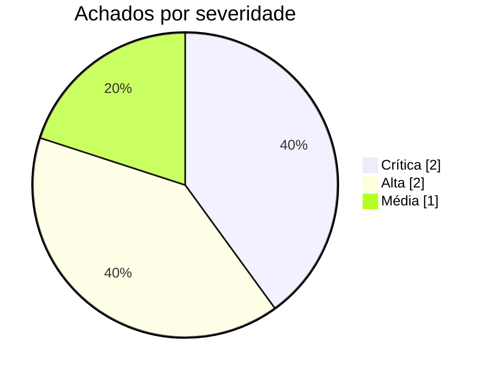

# Relatório de Auditoria de Segurança — acme-saas-api

**Data:** 03/09/2026  
**Escopo auditado:** Backend (src/), migrações (prisma/) e infraestrutura (docker-compose.yml, .github/workflows/)

## Stack detectada
- **Linguagem:** TypeScript (Node.js 20)
- **Framework:** Express 4
- **Orm:** Prisma
- **Autenticacao:** JWT via middleware próprio (src/middlewares/auth.ts)
- **Frontend:** React 18 (Vite)
- **Arquivos deploy:** docker-compose.yml, .github/workflows/deploy.yml

## Nota metodológica
Projeto sem Supabase/RLS nativo — o isolamento de tenant é feito manualmente via workspaceId no middleware requireWorkspace. A categoria 1 foi tratada como 'filtro manual por workspaceId ausente/furado' em vez de RLS.

## Resumo executivo

| Severidade | Qtde |
|---|---|
| 🔴 Crítica | 2 |
| 🟠 Alta | 2 |
| 🟡 Média | 1 |
| **Total** | **5** |



| Categoria | Qtde |
|---|---|
| Banco sem tranca (isolamento de inquilino/dono) | 1 |
| Permissão definida no navegador | 1 |
| IDOR | 1 |
| Chaves expostas (hardcode) | 1 |
| Inputs sem tratamento (XSS) | 1 |

## Pontos fortes
- 🟢 **IDOR** (`src/routes/faturas.ts`): Todos os handlers validam posse do recurso via where: { id, workspaceId } antes de ler, alterar ou deletar.
- 🟢 **Chaves expostas (hardcode)** (`.github/workflows/deploy.yml`): Segredos de deploy usam secrets.* do GitHub Actions corretamente, sem nenhum valor hardcoded encontrado no workflow.
- 🟢 **Inputs sem tratamento (XSS)** (`src/frontend/components/PostBody.tsx`): Conteúdo de posts é renderizado via biblioteca de markdown com sanitização (react-markdown + rehype-sanitize) configurada corretamente.

## Pontos fracos (riscos centrais)
- Banco sem tranca (isolamento de inquilino/dono): 1 achado(s) crítico(s)/alto(s) — ver seção de achados detalhados.
- Permissão definida no navegador: 1 achado(s) crítico(s)/alto(s) — ver seção de achados detalhados.
- IDOR: 1 achado(s) crítico(s)/alto(s) — ver seção de achados detalhados.
- Chaves expostas (hardcode): 1 achado(s) crítico(s)/alto(s) — ver seção de achados detalhados.

## Achados detalhados por categoria
### Banco sem tranca (isolamento de inquilino/dono)
| Severidade | Arquivo:linha | Descrição |
|---|---|---|
| 🔴 Crítica | `src/routes/relatorios.ts:58-64` | Endpoint de exportação de relatórios lista registros de todos os workspaces, sem filtrar por workspaceId do usuário autenticado. |

### Permissão definida no navegador
| Severidade | Arquivo:linha | Descrição |
|---|---|---|
| 🟠 Alta | `src/routes/usuarios.ts:80-95` | O frontend esconde o botão 'Promover a admin' quando isAdmin é falso, mas a rota equivalente no backend só exige o middleware auth (autenticado), não verifica req.usuario.role === 'admin'. |

### IDOR
| Severidade | Arquivo:linha | Descrição |
|---|---|---|
| 🟠 Alta | `src/routes/documentos.ts:112-118` | Rota de exclusão de documento não verifica se o documento pertence ao workspace/usuário que fez a requisição. |

### Chaves expostas (hardcode)
| Severidade | Arquivo:linha | Descrição |
|---|---|---|
| 🔴 Crítica | `docker-compose.yml:22` | Default público de JWT_SECRET vira segredo real em qualquer ambiente onde a variável não seja sobrescrita, e não há validação de startup rejeitando esse valor. |

### Inputs sem tratamento (XSS)
| Severidade | Arquivo:linha | Descrição |
|---|---|---|
| 🟡 Média | `src/frontend/components/ComentarioCard.tsx:34` | Texto de comentário vindo do usuário é renderizado como HTML sem sanitização. |

## Recomendações priorizadas
**P1 — Corrigir isolamento de workspace em queries de listagem/exportação**  
Auditar todos os findMany/aggregate do Prisma e garantir workspaceId no where. Começar por F-01.

**P1 — Adicionar verificação de posse em rotas de escrita/exclusão por ID**  
Padronizar um helper buscarOuFalhar(model, id, workspaceId) e aplicar em todas as rotas DELETE/PATCH que recebem :id.

**P2 — Adicionar checagem de papel no backend para ações administrativas**  
Cruzar todos os gates de UI baseados em isAdmin/role com o endpoint correspondente e adicionar requireRole().

**P3 — Sanitizar HTML gerado por usuário no frontend**  
Aplicar DOMPurify em todos os pontos com dangerouslySetInnerHTML restantes.

## Issues para o GitHub

--- ISSUE 1 ---
### [Segurança] Queries de relatório não filtram por workspace (isolamento de tenant quebrado)

**Labels sugeridas:** `security`, `critica`

**Descrição**
O endpoint de relatórios lista dados de todos os workspaces para qualquer usuário autenticado, quebrando o isolamento multi-tenant.

**Evidência**
`src/routes/relatorios.ts:58-64`
```ts
const relatorios = await prisma.relatorio.findMany({
  where: { status: 'ativo' }
});
```

**Impacto**
Vazamento de dados entre clientes (cross-tenant data leak) — qualquer conta paga tem acesso aos relatórios de todas as outras.

**Sugestão de correção**
Adicionar workspaceId: req.usuario.workspaceId ao where, seguindo o padrão de src/routes/faturas.ts.

**Critérios de aceite**
- [ ] A query em relatorios.ts filtra por workspaceId do usuário autenticado
- [ ] Teste automatizado cobre o caso de dois workspaces distintos e garante que um não vê dados do outro
- [ ] Revisão manual confirma que não há outro findMany/aggregate no mesmo router sem o filtro
--- FIM ISSUE 1 ---

--- ISSUE 2 ---
### [Segurança] IDOR na exclusão de documentos + autopromoção a admin sem checagem de papel no backend

**Labels sugeridas:** `security`, `alta`

**Descrição**
Duas falhas de controle de acesso relacionadas: (1) exclusão de documento por ID não valida posse; (2) promoção a admin não valida papel do requisitante no servidor, apenas no frontend.

**Evidência**
`src/routes/documentos.ts:112-118`
```ts
router.delete('/documentos/:id', auth, async (req, res) => {
  await prisma.documento.delete({ where: { id: req.params.id } });
});
```
`src/routes/usuarios.ts:80-95`
```ts
router.post('/usuarios/:id/promover-admin', auth, async (req, res) => {
  await prisma.usuario.update({ where: { id: req.params.id }, data: { role: 'admin' } });
});
```

**Impacto**
Qualquer usuário autenticado pode apagar documentos de terceiros e se autopromover a administrador.

**Sugestão de correção**
Adicionar verificação de posse (where com workspaceId) na exclusão, e middleware requireRole('admin') na promoção.

**Critérios de aceite**
- [ ] DELETE /documentos/:id retorna 404 para documentos de outro workspace
- [ ] POST /usuarios/:id/promover-admin retorna 403 quando o requisitante não é admin
- [ ] Testes automatizados cobrem os dois casos
--- FIM ISSUE 2 ---

--- ISSUE 3 ---
### [Segurança] Default inseguro de JWT_SECRET no docker-compose

**Labels sugeridas:** `security`, `critica`

**Descrição**
JWT_SECRET tem um valor default público (${JWT_SECRET:-troque-em-producao}) e não há validação de startup que rejeite esse valor em produção.

**Evidência**
`docker-compose.yml:22`
```yaml
JWT_SECRET: ${JWT_SECRET:-troque-em-producao}
```

**Impacto**
Se a variável real não for definida no deploy, tokens podem ser forjados por qualquer pessoa com acesso ao código-fonte público.

**Sugestão de correção**
Remover o default e adicionar checagem de startup que encerra o processo se JWT_SECRET não estiver definido.

**Critérios de aceite**
- [ ] docker-compose.yml não define mais um valor default para JWT_SECRET
- [ ] A aplicação falha ao subir (com mensagem clara) se JWT_SECRET estiver ausente
- [ ] Repetir a mesma checagem para outros segredos com default público, se houver
--- FIM ISSUE 3 ---
